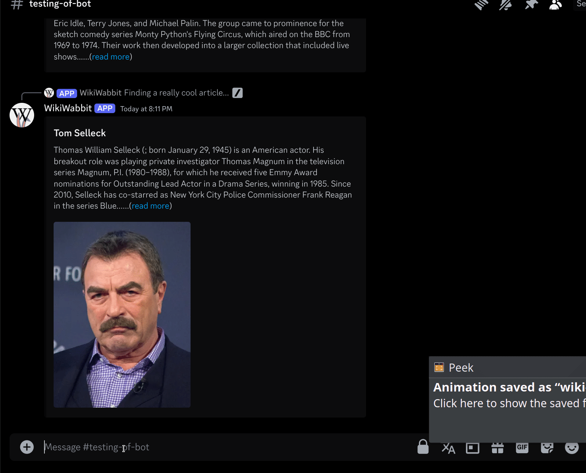

<!-- Banner -->
<figure style="margin: auto; max-height: 200px; padding: 10px 5px 20px 5px;">
   <picture>
      <source media="(prefers-color-scheme: dark)" srcset="docs/assets/Logo/banner_1_no_background_dark_mode.png">
      
   </picture>
</figure>

<br>

[Wiki-Wabbit](https://wikiwabbit.com/) is a discord bot that brings the fun of bingeing Wikipedia articles to your dicord server!

# Directory

+ [Features](#Features)
+ [Technical Points](#Technical-Points)
+ [Install Guide](#Install-Guide)
  + [Discord Token](#Discord-Token)
  + [Firebase Service Account](#Firebase-Service-Account)
  + [Gemini API Key](#Gemini-API-Key)
  + [API Ninjas API Key](#API-Ninjas-Key)
  + [Env Settings](#Env-Settings)
  + [Docker](#Docker)

+ [Shout Outs](#Shout-Outs)
+ [Connection to the theme (Information Overload!)](#connection-to-the-theme-information-overload)
+ [Team Contributions](#Breakdown-of-Team-Contributions)
+ [Tour de Features](#Tour-de-Features)
  + [Wiki Guesser](#wiki-guesser)
  + [Wiki Random](#wiki-random)
  + [Wiki Animal](#wiki-animal)
  + [Rabbit Hole](#rabbit-hole)
  + [Leaderboard and User Info](#Leaderboard-and-User-Info)
  + [Help and Sync](#Help-and-Sync)

# Features

| Command         | Description                                                                |
|-----------------|----------------------------------------------------------------------------|
| [`/wiki-guesser`](#wiki-guesser) | Starts a game of wiki-guesser! Try and find what wikipedia article you're in. |
| [`/wiki-random`](#wiki-random)  | Get a random wikipedia article.                                            |
| [`/wiki-animal`](#wiki-animal)  | Starts a game of wiki-animal! Try and guess the animal's mass!             |
| [`/wiki-search`](#wiki-search)  | Get a Wikipedia article that you searched for.                             |
| [`/rabbit-hole`](#rabbit-hole)  | Dive into wikipedia with AI-guided random exploration!                     |
| [`/leaderboard`](#Leaderboard-and-User-Info)  | Returns your guild's leaderboard.                                          |
| [`/user-info`](#Leaderboard-and-User-Info)    | Returns your stats.                                                        |
| [`/help`](#Help-and-Sync)       | Display a message with much of the same info as this table has.            |
| [`/sync`](#Help-and-Sync)       | Sync the command tree.                                                     |
| `/reset-scores` | Reset scores of all users in this guild for this guild.                    |
| `/never`        | 🥚 Never use this command!                                         |


# Technical Points

<!-- Any interesting technical points you'd like to include go below here. -->

`Wiki-Wabbit` uses `pywikibot` and the Wikipedia REST API. Alongside that, it also makes use of:

+ Firebase
+ Google's Gemini API
+ Ninja API

# Install Guide

[github_install_link]: https://docs.github.com/en/repositories/creating-and-managing-repositories/cloning-a-repository

First, [clone this repository locally][github_install_link].

We require a few resources to get our bot up and running. For starters, we need
to collect some API tokens used by the bot. You should save these in a safe
place; once they're all collected, we'll be putting them into our
[`config.env`](config.env) file.

The first thing we need is a Discord API token.

### Discord Token
<!-- Install guide. -->
Goto the [Discord Application Page](https://discord.com/developers/applications) you should see this screen.
<figure style="margin: auto; max-height: 200px; padding: 10px 5px 20px 5px;">
   <picture>
      
   </picture>
</figure>

After that go and create a discord application by clicking the `New Application` button


Now go down to "Bot" on the left menu and click `Reset Token` that will be your
discord token, put it somewhere safe for later.

While here be sure to turn on the 3 switches below `Privileged Gateway Intents`
 + Presence Intent
 + Server Members Intent
 + Message Content Intent

You should also goto `Installation` in the sidebar menu and goto the Install Link, you can add your bot to your discord server with this, but I would wait till after the bot is running to use it.

### Firebase Service Account

Go to the [Firebase Console](https://console.firebase.google.com/) and click the get started with a Firebase project.
Its name can be anything, so don't worry about that.
After it's made, click on the build tab on the left hand of the screen and scroll down to `Realtime Database`, this will be our database for the bot.
<figure style="margin: auto; max-height: 200px; padding: 10px 5px 20px 5px;">
   <picture>
      
   </picture>
</figure>

After this, we still need to tell the bot what firebase account we are using.
Head to project settings, it should pop up if you click on the gear near
`Project Overview`.  From there navigate to `Service Accounts` and click
`Generate a New Private Key`. This should download a `json` file that serves as
your key for Firebase. Put that file in a safe place that you can get to easily
(e.g., `secrets/firebase_api_key.json`, which is ignored in our `.gitignore`
file).

And that's all for Firebase.

### Gemini API Key
One of our Commands makes use of AI, and since we don't want to force the end user to run a complex AI model, we are using the Google Gemini free plan.

Goto the [Google AI Studio](https://aistudio.google.com/app/apikey) and just click `Create API key`.
Once you have your key, you can store that somewhere safe for later.
Well that was easy.


#### Warning

The API key may need to be associated with a Google Cloud Project. You can use
the Firebase project created in the previous step, which should be available
from the "Search Google Cloud project" search bar with the same name you gave
it.

### API Ninjas Key
Goto [API Ninjas](https://api-ninjas.com/) and create an account and log in. After you make it, [goto your profile](https://api-ninjas.com/profile).
From here scroll down a bit and click `Show API Key`, copy it, and save it somewhere safe for later.

Now that we have all of our keys and service accounts, it's time to configure the bot!

### Env Settings.
We have included a [config.env](config.env) to allow you to easily set up environment variables for the bot.
+ `TOKEN` is your [Discord API token](#discord-token)
+ `CERT_PATH` is your [Firebase Service Account file path](#firebase-service-account).
+ `GEMINI_API_KEY` is your [Google Gemini API key](#gemini-api-key).
+ `NINJA_API_KEY` is your [API Ninjas API key](#api-ninjas-key).


> [!IMPORTANT]
> ### Rename `config.env` to `.env`
> After you set these, be sure rename `config.env` to just `.env` so the docker knows what to use. _You will get a `KeyError` if you do not do this step_!

### Docker
After you set up your env you can run
```
docker build --tag wikiwabbit .
```
and then after that finishes with no errors run
```
docker run wikiwabbit
```
and everything should be up and running. Return to discord, and check out your bot - however, you might want to kick and reinvite it to auto sync the command tree.

# Shout Outs

Thank you Python Discord for putting this on, I dont think anyone in our team has ever done something like this. And I will do this continuing forward. Really happy with the result.

Enjoy the bot, a lot of work went into this. It was a passion for all of us apart of this team, we had a great time, we poured our all into our features, thank you to the team, theheretic_, WONG-TONG48, teald, spenpal, lotus.css, Xanthian.

# Connection to the theme (Information Overload!)

Wikipedia and wiki sites are notorious for offering users a simple means of digging more deeply into topics---especially topics relatively removed from their original intent. This can lead to a straightforward search becoming a meandering path through various topics, leading to an _overload_ of _information_. The colloquialism for this is "going down a [wiki rabbit hole](https://en.wikipedia.org/wiki/Wiki_rabbit_hole)".

Wiki-wabbit is a tool for expanding on this experience through Discord. Alongside the eponymous `/rabbit-hole` command, other commands allow for engaging with Wikipedia's wealth of information in other ways, such as playing games and pulling up random articles.

# Breakdown of Team Contributions

## `theheretic_`

+ `wikiutils` Implementation (with WONG_TONG)
+ `Database` Implementation + refactoring (with lotus.css)
+ `Leaderboard` Implementation + refactoring (with lotus.css)
+ `Help` Implementation
+ `User Info` Implementation
+ Web hosting
+ Docker
+ Initial Idea
+ Team Engagement
+ Install Guide
+ General Debugging
+ Hosting the bot
+ Optimization

## `WONG_TONG48`

+ Setup filesystem
+ `wikiguesser` Implementation
+ Created `wikiguesser` (`Button`) classes
+ `wikiutils` Implementation (with theheretic_)
+ `wiki-search` Implementation

## `teald`

+ `ArticleGenerator` Implementation (+ minimal testing)
+ `GiveUpButton` Implementation
+ `wikiutils` refactoring
+ Documentation work (docstrings + some README work)
+ Manual testing for functions/installs and instructions
+ Wiki-Wabbit logo, banners, and icons
+ Initial [Connection to the Theme](#connection-to-the-theme-information-overload)

## `spenpal`

+ `RabbitHole` Implementation
+ Conventional Commits Foundation
+ Added additional "annoying" linting rules
+ Regex assist

## `lotus.css`

+ `Database` Implementation (with theheretic_)
+ `Leaderboard` Implementation (with theheretic_)
+ `User` Implementation
+ `Button` Classes Implementaion + Refactoring

## `Xanthian`

+ `wikianimal` Implementation
+ [Website](https://wikiwabbit.com/)


# Tour de Features

### Wiki-Guesser
The goal of wiki guesser is to encourage user's to guess the topic of the wikipedia article based on excerpts from the article. This can get user's overloaded with information due to the sheer number of possible topics that could appear, and the clues given.

Wiki Guesser was our initial feature and led to the creation of wiki utils and button class to abstract reusable components that would be used in our other features. This includes responding to interactions, sending modals, accepting inputs, interfacing with wikipedia, and our database.

1. Users can play ranked or unranked. If ranked, their score and username will be added to the leaderboard.
2. Utilizing wiki-random, an article is chosen.
3. An excerpt of the article's main text is taken, and all direct reference to the article's subject (title) is censored.
4. A portion of the excerpt is shown to the user.
5. A user can choose to:
   - Show More
      - This will reveal a larger portion of text from the article.
   - Give Up
      - Giving up will end the game, but no points will be awarded.
   - Guess
      - Accept a guess as to the article's topic from the user.
   - Show Links
      - Show links inside that article to try and gain insight into what it is.
6. If the user's guess is not an exact match, we do a wiki-search. If the search leads to the same article, than we can accept the user's input as accurate enough to win!


### Wiki-Random
This will retrieve a random article for the user.

Wikipedia's articles are vast yet wildly inconsistent in quality. Rather than grab a random article that might be uninteresting, the following steps are taken.

1. Generate a random date within the last 8 years.
2. Request a list of the top 1000 wikipedia articles for that random day.
3. Return a single random article from this recent and popular list to the user.


### Wiki-Animal
Wiki animal is built on both the wiki guesser feature and the wikiutils retrieve article by category feature.
1. When a user starts a wiki-animal game the bot searches through a specific category of mammals on Wikipedia, and returns a random mammal's Wikipedia page.
2. Pywikibot allows us to ask for the most appropriate image for the article, which is used to provide the user a basis for judging the animals mass.
3. Because most wikipedia articles do not have consistent weight data, a query is sent to ninja's animal API service to retrieve weight details of the random animal.
4. Even ninjas API has inconsistently formatted weight data, so we use a regex and Pint to process the string into a quantity with magnitude and units.
5. When a user guesses the animals weight, their input is converted to a quantity as well and compared to the animals retrieved quantity. This allows users to guess more naturally in their preferred imperial / metric units of measurement.


### Wiki-Search
Searches wikipedia for an article based on user's query.

1. Attempt to go directly to a wikipedia article with the same title as the query.
2. If article does not exist, use pywikibot to search wikipedia, and retrieve a list of articles that match this query.
3. We check the list to find the single best result and return that article to the user.
4. If no articles are found, inform the user.


### Rabbit Hole
Rabbit Hole is an AI bot command designed to turn the vast sea of Wikipedia into an interactive, educational journey. Rabbit Hole randomly guides you through the knowledge labyrinth, helping you manage information overload using AI summarization, while making learning fun and engaging.

**Core Functionality**
- Random Exploration
   - Simply type the command, and Rabbit Hole will fetch a random Wikipedia page.
- AI Summarization
   - Rabbit Hole utilizes Google Gemini to summarize large contexts of information effectively and efficiently, and presents the summary to the user.
- Topic Suggestions
   - Along with the summary, Rabbit Hole suggests related topics such as "Greenhouse Gas Emissions," "Global Warming," and "Paris Agreement."
   - The user can then choose to explore any of these topics, leading to another summary and a fresh set of related topics.

Connection to the Theme: "Information Overload"

Rabbit Hole directly addresses the theme of "Information Overload" by offering tools and features designed to help users navigate and manage vast amounts of information effectively. Instead of bombarding users with endless text, Rabbit Hole curates, summarizes, and organizes content in a way that keeps the experience informative yet manageable. By allowing users to control the depth of information and guiding them through related topics, Rabbit Hole transforms overwhelming data into a structured, enjoyable learning journey.


### Leaderboard and User Info
Display user score data for the top players in the current guild.

If option *globe* is set to yes, you can view top scores for players around the world.


### Help and Sync
- Display help text from commands available in the bot comamnd tree.
- Sync the command tree to the guild it is called in, aka update the commands in the guild.


